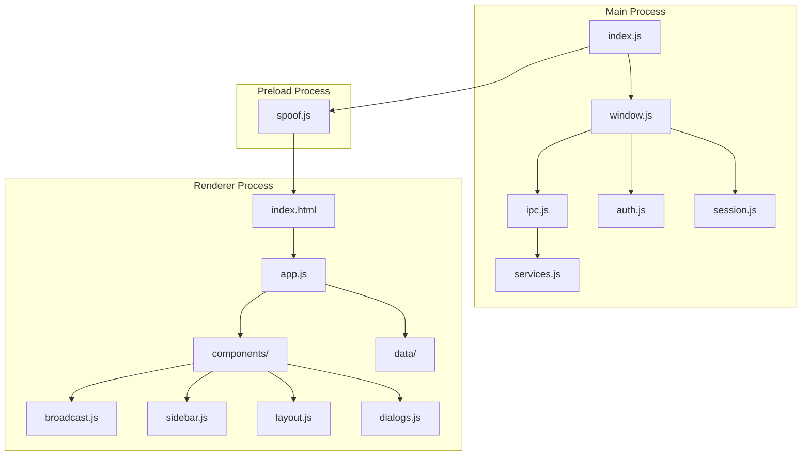
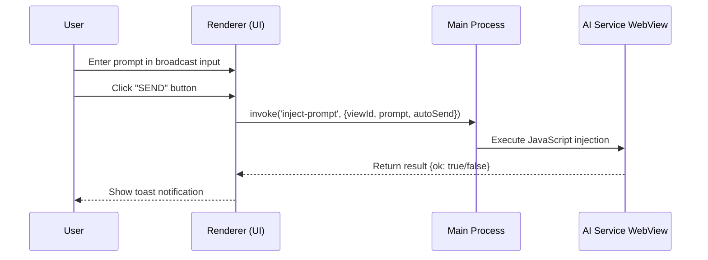
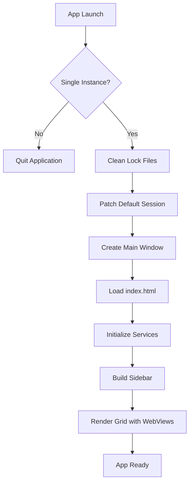
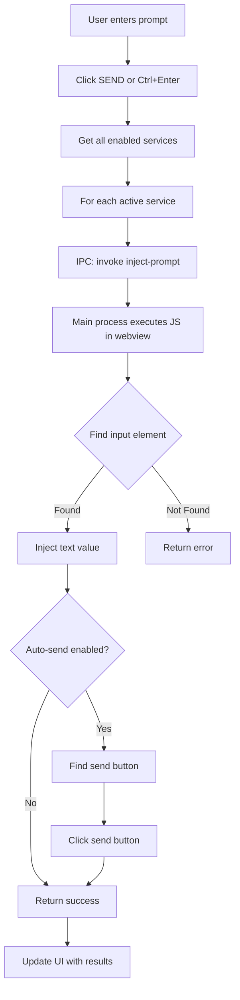
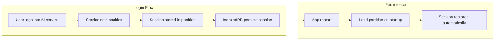
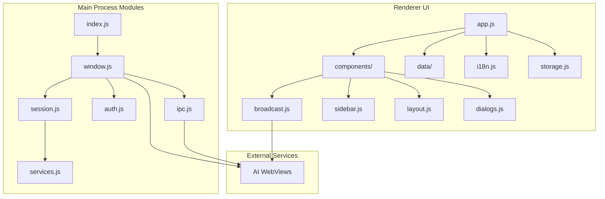

# ViceBrain

<div align="center">
  
  <h1>ViceBrain</h1>
</div>

<div align="center">

[](https://github.com/abelnhm/ViceBrain)
[](LICENSE)
[](https://www.electronjs.org/)
[]()
[](https://github.com/abelnhm/ViceBrain)
[](https://github.com/abelnhm/ViceBrain)

</div>

ViceBrain is a powerful multi-service AI chat browser that enables users to interact with multiple artificial intelligence services simultaneously in a single unified interface. Designed for developers, researchers, and AI enthusiasts who need to compare responses across different models or work with multiple AI platforms concurrently.

## Key Features

- **Multi-Service Integration**: Access up to 13 AI chat services from a single application
- **Broadcast Mode**: Send prompts to all active AI services simultaneously
- **Parallel Viewing**: View multiple AI chat interfaces in customizable column or grid layouts
- **Persistent Sessions**: Login once, stay logged in across sessions
- **Custom Services**: Add your own AI services beyond the default offerings
- **Theme Support**: Dark and light themes with customizable color schemes
- **Bilingual Interface**: Full support for Spanish and English

---

## Installation

### Prerequisites

Before installing ViceBrain, ensure your system meets the following requirements:

| Requirement | Minimum Version | Recommended Version |
|-------------|-----------------|---------------------|
| Node.js     | 18.x            | 20.x LTS            |
| npm         | 8.x             | 10.x                |
| Operating System | Windows 10 / macOS 10.15 / Ubuntu 20.04 | Latest stable |

### Installation Steps

1. **Clone the repository**

   ```bash
   git clone https://github.com/abelnhm/ViceBrain.git
   cd ViceBrain
   ```

2. **Install dependencies**

   ```bash
   npm install
   ```

3. **Start the application in development mode**

   ```bash
   npm start
   ```

### Local Execution

To run the application locally for development or testing:

```bash
# Start in development mode with hot reload
npm start

# Or run with additional debugging tools
npm start -- --enable-logging
```

---

## Building Executables

ViceBrain uses [electron-builder](https://www.electronjs.org/docs/latest/api/builder) to generate platform-specific executables. The build process creates standalone binaries that can be distributed without requiring Node.js or npm on the target machine.

### Windows

Generate a Windows portable executable:

```bash
npm run build:win
```

**Output location:** `dist/ViceBrain.exe`

**Notes:**
- The portable executable does not require installation
- Run as administrator may be needed for first-time execution
- Windows Defender may flag the application; this is normal for unsigned executables

### macOS

Generate a macOS disk image:

```bash
npm run build:mac
```

**Output location:** `dist/ViceBrain.dmg`

**Notes:**
- Requires macOS 10.15 (Catalina) or later
- Code signing is recommended for distribution outside App Store
- Gatekeeper may require manual approval for first run

### Linux

Generate a Linux AppImage:

```bash
npm run build:linux
```

**Output location:** `dist/ViceBrain`

**Notes:**
- Requires FUSE for mounting
- AppImage is portable across most major distributions
- May require making the file executable: `chmod +x ViceBrain`

### Build All Platforms

To build executables for all supported platforms:

```bash
npm run build
```

---

## Architecture

ViceBrain follows a **multi-process architecture** based on Electron's security model, separating the main process, preload scripts, and renderer processes for maximum security and stability.

### Process Layers



### Layer Responsibilities

| Layer | Module | Responsibility |
|-------|--------|----------------|
| **Main Process** | `index.js` | Application lifecycle, single instance lock, command-line switches |
| **Main Process** | `window.js` | BrowserWindow creation, session patching, webview management |
| **Main Process** | `ipc.js` | Inter-process communication handlers for prompt injection |
| **Main Process** | `auth.js` | OAuth flow handling, external browser integration |
| **Main Process** | `session.js` | Session security patches, lock file cleanup |
| **Main Process** | `services.js` | Service definitions, user agent configuration |
| **Preload** | `spoof.js` | Browser fingerprint spoofing, security workarounds |
| **Renderer** | `app.js` | Core application logic, state management, event handling |
| **Renderer** | `broadcast.js` | Prompt injection orchestration |
| **Renderer** | `sidebar.js` | Service list management, favorites system |
| **Renderer** | `layout.js` | Column and grid layout management |
| **Renderer** | `dialogs.js` | Modal dialogs for service management |
| **Renderer** | `i18n.js` | Internationalization (Spanish/English) |
| **Renderer** | `storage.js` | LocalStorage abstraction |

---

## Directory Structure

```
vicebrain/
├── src/
│   ├── main/                    # Electron main process
│   │   ├── index.js             # Application entry point
│   │   ├── window.js            # Window creation and management
│   │   ├── ipc.js               # IPC handlers for prompt injection
│   │   ├── auth.js              # Authentication flow handling
│   │   ├── session.js           # Session patching and cleanup
│   │   └── services.js          # Service definitions and configuration
│   │
│   ├── preload/                 # Preload scripts
│   │   └── spoof.js             # Browser fingerprint spoofing
│   │
│   └── renderer/                # Frontend UI
│       ├── index.html           # Main HTML structure
│       ├── css/
│       │   └── styles.css       # Complete styling (387 lines)
│       ├── data/
│       │   └── services.json    # Service definitions (JSON)
│       └── js/
│           ├── app/
│           │   ├── app.js        # Core application logic
│           │   ├── i18n.js      # Internationalization (ES/EN)
│           │   └── storage.js   # LocalStorage wrapper
│           ├── components/
│           │   ├── sidebar.js    # Service list sidebar
│           │   ├── layout.js    # Layout management (cols/grid)
│           │   ├── broadcast.js # Prompt injection logic
│           │   └── dialogs.js   # Dialog/modals
│           └── data/
│               └── services-data.js  # Services array definition
│
├── assets/
│   └── icons/
│       ├── icon.png             # Application icon
│       ├── windows/              # Windows-specific icons
│       ├── macos/               # macOS-specific icons
│       └── linux/               # Linux-specific icons
│
├── package.json                 # Project metadata and build configuration
├── package-lock.json           # Dependency lock file
├── README.md                   # Project documentation
└── .gitignore                  # Git ignore rules
```

### Directory Descriptions

| Directory | Description |
|-----------|-------------|
| `src/main/` | Electron main process code handling app lifecycle, window management, and system integration |
| `src/preload/` | Preload scripts providing secure bridges between main and renderer processes |
| `src/renderer/` | Frontend UI code including HTML, CSS, and JavaScript for the user interface |
| `assets/icons/` | Application icons for different platforms and resolutions |
| `src/renderer/js/app/` | Core application logic including state management and utilities |
| `src/renderer/js/components/` | Reusable UI components for sidebar, layout, broadcast, and dialogs |
| `src/renderer/js/data/` | Static data definitions for AI services |

---

## Main Files

### Core Application Files

| File | Purpose | Key Functions |
|------|---------|---------------|
| `src/main/index.js` | Application entry point | Single instance lock, command-line switches, user agent patching |
| `src/main/window.js` | Window management | BrowserWindow creation, session patching, webview wiring |
| `src/main/ipc.js` | IPC communication | Prompt injection execution, view reloading |
| `src/main/auth.js` | Authentication | OAuth handling, external browser for Google auth |
| `src/main/session.js` | Session security | CSP/X-Frame removal, lock file cleanup |
| `src/main/services.js` | Service configuration | Service definitions, Chrome user agent |
| `src/preload/spoof.js` | Security bypass | Fingerprint spoofing, navigator property override |

### Frontend Files

| File | Purpose | Key Functions |
|------|---------|---------------|
| `src/renderer/index.html` | Main HTML | DOM structure, dialogs, layout containers |
| `src/renderer/css/styles.css` | Styling | Complete CSS with dark/light themes, responsive design |
| `src/renderer/js/app/app.js` | Core logic | Theme toggle, language switch, service initialization |
| `src/renderer/js/components/broadcast.js` | Broadcast mode | Prompt injection to all active services |
| `src/renderer/js/components/sidebar.js` | Service management | Toggle services, favorites, custom services |
| `src/renderer/js/components/layout.js` | Layout management | Column resize, grid mode, responsive layout |
| `src/renderer/js/components/dialogs.js` | UI dialogs | Add service, confirm delete dialogs |
| `src/renderer/js/app/i18n.js` | Internationalization | Spanish/English translations |
| `src/renderer/js/app/storage.js` | Persistence | LocalStorage abstraction |

### File Interactions



---

## Data Flow

### Application Startup Flow



### Prompt Injection Flow



### Session Persistence Flow



### Data Storage

| Storage Type | Location | Purpose |
|--------------|----------|---------|
| LocalStorage | Renderer process | UI preferences, enabled services, custom services |
| Session Partition | Electron partitions | Persistent login sessions per AI service |
| IndexedDB | Partitions directory | Service-specific database storage |

---

## Supported AI Services

ViceBrain comes pre-configured with 13 AI chat services:

| Service | URL | Color | Status |
|---------|-----|-------|--------|
| Gemini | https://gemini.google.com/app | #4285f4 | Limited |
| ChatGPT | https://chatgpt.com/ | #10a37f | Active |
| Claude | https://claude.ai/new | #cc785c | Active |
| Kimi | https://www.kimi.com/ | #8b5cf6 | Active |
| DeepSeek | https://chat.deepseek.com/ | #06b6d4 | Active |
| Qwen | https://chat.qwen.ai/ | #f59e0b | Pending |
| Mistral | https://chat.mistral.ai/chat | #f97316 | Limited |
| Grok | https://grok.com/ | #c8d0da | Active |
| Z | https://chat.z.ai/ | #7c3aed | Active |
| Copilot | https://copilot.microsoft.com/ | #00a4ef | Limited |
| Perplexity | https://www.perplexity.ai/ | #f59e0b | Active |
| Meta AI | https://www.meta.ai/ | #0081fb | Active |
| Luzia | https://chat.luzia.com/ | #06b6d4 | Limited |

---

## Configuration

### Environment Variables

ViceBrain does not require environment variables for basic operation. However, for advanced configuration:

| Variable | Description | Default |
|----------|-------------|---------|
| `ELECTRON_DISABLE_SECURITY_WARNINGS` | Disable security warnings | Not set |
| `ELECTRON_ENABLE_LOGGING` | Enable logging to console | Not set |

### Build Configuration

The build process is configured in `package.json`:

```json
{
  "build": {
    "appId": "com.vicebrain.app",
    "productName": "ViceBrain",
    "win": { "target": "portable" },
    "mac": { "target": "dmg" },
    "linux": { "target": "AppImage" }
  }
}
```

---

## Module Relationships



---

## Troubleshooting

### Common Issues

| Issue | Solution |
|-------|----------|
| Application won't start | Run `npm install` to ensure all dependencies are installed |
| Login not persisting | Clear partitions in AppData/ViceBrain/Partitions |
| Services not loading | Check internet connection and firewall settings |
| Prompt injection fails | Wait for service to fully load before sending |
| Window too large/small | Use column resize handles or switch to grid mode |

### Session Storage Locations

| Operating System | Path |
|------------------|------|
| Windows | `%APPDATA%\vicebrain\Partitions\` |
| macOS | `~/Library/Application Support/vicebrain/Partitions/` |
| Linux | `~/.config/vicebrain/Partitions/` |

### Cache & Data Clearing

To clear application cache and reset the app state (including the legal disclaimer modal):

#### Windows

```powershell
# Full reset (remove all app data)
Remove-Item -Recurse -Force "$env:APPDATA\vicebrain\*"

# Cache only (keep settings and sessions)
Remove-Item -Recurse -Force "$env:APPDATA\vicebrain\Cache\*"
Remove-Item -Recurse -Force "$env:APPDATA\vicebrain\Code Cache\*"

# Using CMD
rd /s /q "%APPDATA%\vicebrain"
```

#### macOS

```bash
# Full reset
rm -rf ~/Library/Application\ Support/vicebrain

# Cache only
rm -rf ~/Library/Application\ Support/vicebrain/Cache
rm -rf ~/Library/Application\ Support/vicebrain/Code\ Cache
```

#### Linux

```bash
# Full reset
rm -rf ~/.config/vicebrain

# Cache only
rm -rf ~/.config/vicebrain/Cache
rm -rf ~/.config/vicebrain/Code\ Cache
```

After clearing, run `npm start` to see the legal disclaimer modal again.

### Security Notes

ViceBrain includes several security bypass mechanisms for embedding AI services:

- **User-Agent Spoofing**: Mimics Chrome 124 to avoid detection
- **CSP Removal**: Strips Content-Security-Policy headers
- **X-Frame-Options Removal**: Enables embedding of normally blocked sites
- **Certificate Error Ignoring**: Allows running with invalid certificates

> **Warning**: These bypasses are necessary for the application to function but may reduce security. Use only with trusted AI services.

---

## Legal Disclaimer & Liability Limitation

> **IMPORTANT**: Please read this section carefully before using, modifying, or distributing ViceBrain.

### Exención de Responsabilidad / Disclaimer of Liability

**ESTE SOFTWARE SE PROPORCIONA "TAL CUAL" PARA FINES EDUCATIVOS Y DE INVESTIGACIÓN.**

ViceBrain is provided "AS IS" for educational and research purposes. The original author and contributors are **NOT LIABLE** for:

| Consecuencia / Consequence | Descripción / Description |
|---------------------------|--------------------------|
| ToS Violations | Violations of third-party Terms of Service |
| Account Suspension | Suspension or blocking of accounts on AI services |
| Legal Implications | Legal consequences under computer fraud laws (CFAA, DMCA, etc.) |
| Direct/Indirect Damages | Any economic loss, data loss, or business interruption |
| Unauthorized Modifications | Issues arising from modified versions |

**USE AT YOUR OWN RISK. USO BAJO SU PROPIO RIESGO.**

### Responsabilidad del Usuario / User Responsibility

The user is **solely responsible** for ensuring that their use of this software complies with:

1. Applicable laws in their jurisdiction
2. Terms of Service of all AI services used
3. Local regulations on software and cybersecurity
4. Any academic or institutional policies

### Third-Party Services Notice

ViceBrain interacts with services owned by third-party companies:

| Company | Services |
|---------|----------|
| OpenAI | ChatGPT |
| Google | Gemini |
| Anthropic | Claude |
| Moonshot AI | Kimi |
| DeepSeek AI | DeepSeek |
| Alibaba Cloud | Qwen |
| Mistral AI | Mistral |
| xAI | Grok |
| Z AI | Z |
| Microsoft | Copilot |
| Perplexity AI | Perplexity |
| Meta | Meta AI |
| Luzia | Luzia |

Use of this application may violate these services' Terms of Service. The user assumes all risks.

### Modification & Redistribution Guidelines

If you modify or redistribute this software:

1. **Attribution Required**: Clearly credit the original project
   - Project name: **ViceBrain**
   - Original author: **Abel Naharro**
   - Repository URL: `https://github.com/abelnhm/ViceBrain`

2. **No Commercial Use**: Commercial use requires explicit authorization

3. **Include This Disclaimer**: All redistributions must include this legal notice

---

## License

MIT License with Educational Use Clauses - See [LICENSE](LICENSE) file for complete terms and conditions.

---

## Contributing

Contributions are welcome. Please ensure all tests pass before submitting pull requests.

---

## Acknowledgments

- [Electron](https://www.electronjs.org/) - Cross-platform desktop application framework
- [electron-builder](https://www.electron.build/) - Complete solution to package and build Electron apps
- All AI service providers for their excellent APIs
